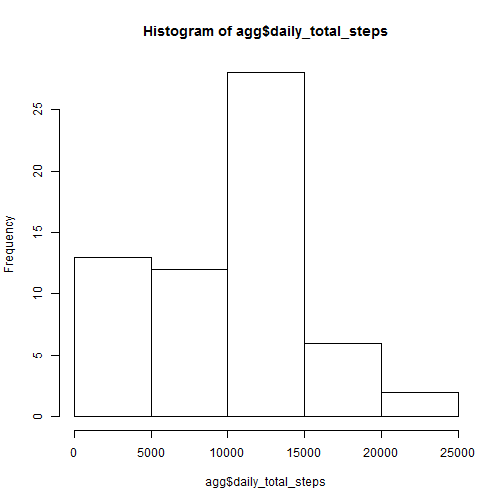
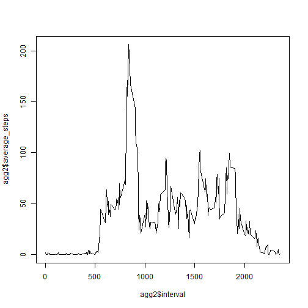
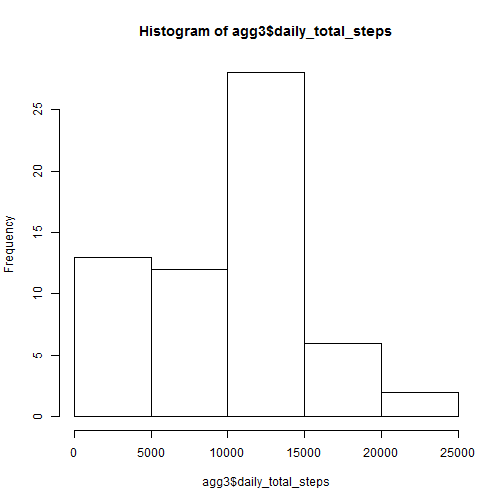

This is an R Markdown document. Markdown is a simple formatting syntax for authoring HTML, PDF, and MS Word documents. For more details on using R Markdown see <http://rmarkdown.rstudio.com>.

When you click the **Knit** button a document will be generated that includes both content as well as the output of any embedded R code chunks within the document. You can embed an R code chunk like this:


```r
activity<-read.csv("activity.csv")
```

```
## Warning in file(file, "rt"): cannot open file 'activity.csv': No such file
## or directory
```

```
## Error in file(file, "rt"): cannot open the connection
```
Load the CSV file

```r
agg<-aggregate(activity$steps,by=list(daily_total_steps=activity$date),na.rm=TRUE,FUN=sum) #calculate daily total steps
colnames(agg)<-c("date","daily_total_steps")
```
Calculate and plot the histogram of total steps per day

```r
hist(agg$daily_total_steps)
```

 


```r
mean_daily_total_steps<-mean(agg$daily_total_steps,na.rm=TRUE)
median_daily_total_steps<-median(agg$daily_total_steps,na.rm=TRUE)
print (mean_daily_total_steps)
```

```
## [1] 9354.23
```

```r
print (median_daily_total_steps)
```

```
## [1] 10395
```
Above steps, Calculate the mean and median of total number of steps taken per day 

```r
agg2<-aggregate(activity$steps,by=list(interval=activity$interval),na.rm=TRUE,FUN=mean) 
#calculate the average number of steps taken 
colnames(agg2)<-c("interval","average_steps")
plot(agg2$interval,agg2$average_steps,type="l") 
```

 

```r
#plot interval & average_steps
```
Above steps,Plot the interval & average_steps

```r
total_NA<-sum(is.na(activity$steps)==TRUE) 
print(total_NA)
```

```
## [1] 2304
```

```r
#calcualte total NA
```
Above is total number of NA

```r
activity_NoNA<-merge(activity,agg,by="date")  
#merge the two table
for (i in 1:nrow(activity_NoNA)){
  if (is.na(activity_NoNA[i,2])==TRUE)  {activity_NoNA[i,2]=activity_NoNA[i,4]}
}
agg3<-aggregate(activity_NoNA$steps,by=list(daily_total_steps=activity_NoNA$date),na.rm=TRUE,FUN=sum) 
colnames(agg3)<-c("date","daily_total_steps")
```
Above steps, input daily_mean_of_steps into N.A and create a new dataset
Plot the daily total steps in new dataset with no N.A

```r
hist(agg3$daily_total_steps)
```

 

```r
mean_daily_total_steps<-mean(agg3$daily_total_steps,na.rm=TRUE)
median_daily_total_steps<-median(agg3$daily_total_steps,na.rm=TRUE)
print (mean_daily_total_steps)
```

```
## [1] 9354.23
```

```r
print (median_daily_total_steps)
```

```
## [1] 10395
```
Above, calculate and print the mean and median of daily total steps in new dataset where N.A are replaced

```r
library(chron)
activitywk<-read.csv("activity.csv")
```

```
## Warning in file(file, "rt"): cannot open file 'activity.csv': No such file
## or directory
```

```
## Error in file(file, "rt"): cannot open the connection
```

```r
activitywk$wk<-is.weekend(activity$date)
for (i in 1:nrow(activitywk)){
  if ((activitywk[i,4])==TRUE)  {activitywk[i,4]="weekend"}
  else {activitywk[i,4]="weekdays"}
} 
activitywday<-activitywk[activitywk$wk=="weekdays",]
activityweekend<-activitywk[activitywk$wk=="weekend",]
agg4_weekday<-aggregate(activitywday$steps,by=list(interval=activitywday$interval),na.rm=TRUE,FUN=mean)
agg4_weekend<-aggregate(activityweekend$steps,by=list(interval=activityweekend$interval),na.rm=TRUE,FUN=mean)
```
Above steps create a new factor variable in dataset with "weekday" and "weekend", and create weekday/weekend datasets with average number of steps taken.

```r
colnames(agg4_weekday)<-c("interval","average_steps_weekday")
colnames(agg4_weekend)<-c("interval","average_steps_weekend")
par(mfrow=c(2,1))
plot(agg4_weekday$interval,agg4_weekday$average_steps_weekday,type="l",xlab="interval", ylab="average steps weekday") #plot interval & average_steps Weekday
plot(agg4_weekend$interval,agg4_weekend$average_steps_weekend,type="l",xlab="interval", ylab="average steps weekend") #plot interval & average_steps Weekend
```

 
Time-series plot of 5-min interval and the average number of steps taken, averaged across all weekdays or weekend.

